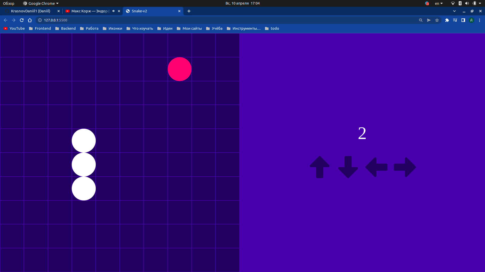
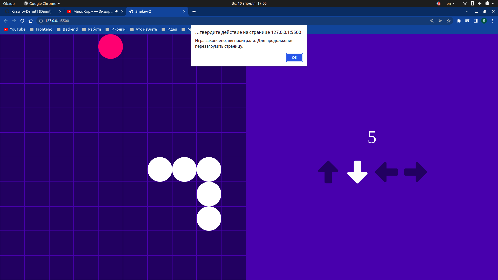
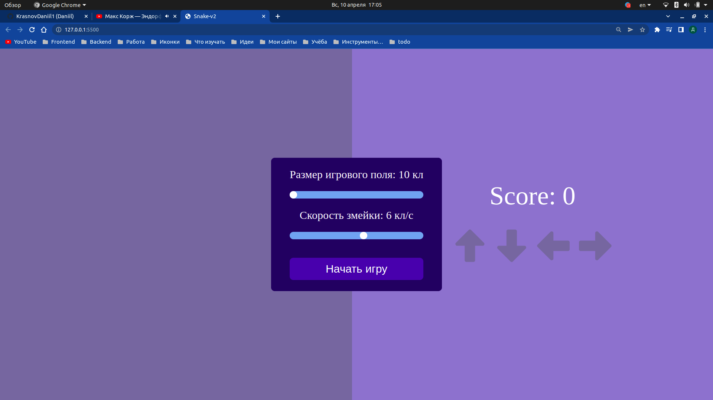
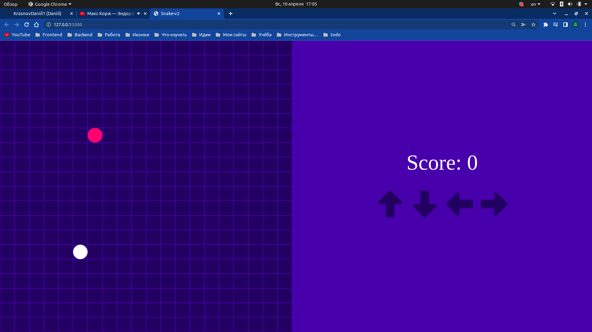

  <h1>Игра Змейка V2</h1>
  Игра написана на JS, без использования библиотек и canvas. Змейка двингаеться во все стороны и если змейка подходит к границе игрового поля то           начинает идти с другово конца поля. У новой версии змейки можно выбрать скорость змейки и размер игрового поля, исправлена проблема с внезапным            концом игры и переработан дизайн. 
  
  
  
  
  

